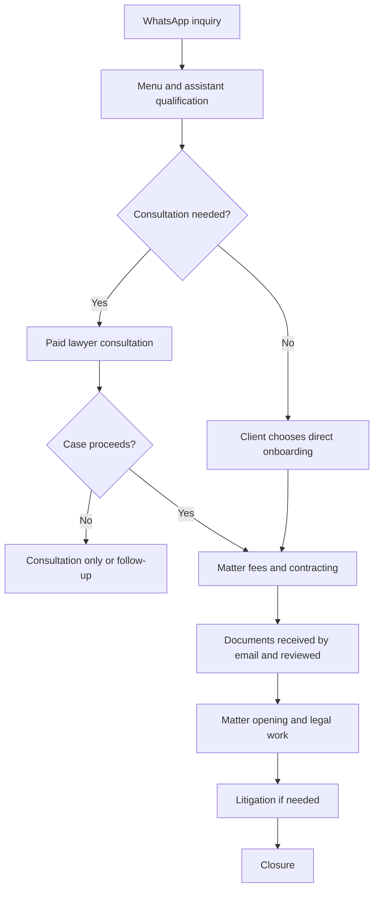

# Operacao LegalTech

**Author:** Nubia Aparecida Silva Almeida
**Special thanks:** Adwiteey Mauriya, for his support during the project.
**Course:** Data Analysis and IT Applied to Management, Prepara Portugal

A synthetic law-office analytics project with a PostgreSQL data pipeline, a static
Plotly dashboard, and a private WhatsApp/email automation module.

## Download the dissertations

**[Open the interactive dashboard](https://asalmenubia.github.io/operacao_legaltech_2026_my_first_project/)**

The dashboard includes filters, synthetic operational indicators and downloads
of both dissertation editions. GitHub Pages publishes the validated pipeline
output after successful checks on `main`.

- [European Portuguese PDF](site/reports/operacao_legaltech_dissertation_pt-PT.pdf)
- [English PDF](site/reports/operacao_legaltech_dissertation_en.pdf)

Both APA-style editions include the author's full name, a special acknowledgment of support,
business workflow, corrected response policy, architecture, synthetic results,
automation, governance, limitations and references. Editable narrative sources
are in `docs/dissertation/`; the original report filename remains an English alias.

## Business workflow and corrected schedule

The office is open **Monday-Friday, 09:00-18:00**. A contact received outside that
schedule is due a human response **by 10:00 on the next working day**. A weekday
08:30 message is due that day at 10:00; Friday evening and weekend messages are
due Monday at 10:00. Automatic acknowledgments do not count as human replies.
The configurable default time zone is `Europe/Lisbon`; holidays are not excluded.
During open hours, the specification calls for prompt service without an added
numerical target.



Status requests and clarification-only contacts need not become a matter. The
[business workflow guide](docs/CLIENT_CONSULTATION_AND_DATA_WORKFLOW.md) explains
the branches; the [automation guide](docs/COMMUNICATION_AUTOMATION.md) explains
channel intake, deadlines, private service configuration and operating limits.

## Implementation status

The retained synthetic snapshot passed validation with zero critical findings
and 3,000 documented identity-mapping warnings. It contains 1,000 rows per source
entity and supports four dashboard areas: executive overview, matters/documents,
inquiries/consultations and billing/payments. Unresolved source identities retain
neutral labels instead of invented employee matches.

The new communications module includes signed WhatsApp webhooks, header-only
IMAP collection, SMTP/Meta adapters, a durable sending queue, staff reply commands
and deadline tracking. **Live messaging is not activated.** It requires private
provider credentials, a hosted Python service, scheduled workers and assigned
staff. Public GitHub Pages hosting serves the dashboard and PDFs only.

For actual validation results and deployment status, see
[release validation](docs/RELEASE_VALIDATION.md).

## Structure

```text
alembic/                 Versioned migrations (0001-0004)
data/raw/                Original synthetic CSVs
data/cleaned/            Normalized synthetic CSVs
data/review/             Reconciliation evidence
docs/dissertation/       Equivalent English and European Portuguese narratives
docs/                    Workflow, governance, setup and release documentation
migrations/              SQL snapshots and quality checks
src/communications/      Private intake, office policy, outbox and channel adapters
src/                     Cleaning, loading, validation, dashboard and PDF builders
tests/                   Unit tests and isolated PostgreSQL integration checks
site/                    Public synthetic dashboard and bilingual PDFs
.github/workflows/       Isolated validation and static Pages publication
.env.example             Configuration names; no live credentials
```

The data path is `raw -> cleaned -> staging -> core -> analytics -> static site`.
A separate private `communications` schema holds channel requests and outgoing
messages; it is not exported by `src.build_dashboard`. Its optional inquiry link
is for reviewed reconciliation, not automatic client identity matching.

## Setup and checks

Use UV for all Python operations. Copy `.env.example` to a private `.env` and
configure your PostgreSQL connection, then:

```sh
uv sync
uv run python -m alembic upgrade head
uv run python -m src.load_csvs
uv run python -m src.validate_database
uv run python -m src.build_dashboard
uv run python -m unittest discover -s tests -v
uv run python -m src.build_dissertation_report
```

Migrations are additive. Do not run `src.reset_database` against operational data;
it is a destructive development rebuild. See the
[beginner guide](docs/BEGINNER_STEP_BY_STEP_GUIDE.md).

Preview the static site:

```sh
uv run python -m http.server 8765 --directory site
```

Open `http://localhost:8765`. Plotly loads from a pinned jsDelivr asset. The PDFs
can be opened directly without the dashboard or database. Building them requires
Times New Roman (macOS) or Liberation Serif (Linux).

## Communication service

Start with `COMMUNICATIONS_LIVE_SEND=false`. Configure credentials only on a
private host and follow [the service guide](docs/COMMUNICATION_AUTOMATION.md).

```sh
uv run python -m src.communications serve
uv run python -m src.communications poll-email
uv run python -m src.communications queue
```

`work-once` transmits one queued item only when live sending is enabled.
A Friday WhatsApp contact may require an approved re-engagement template on
Monday because the channel's free-text window and the office's schedule are
separate rules. The CLI supports a staff-selected parameter-free template;
provider approval is external. Automatic/template messages do not meet the
human-response target.

## Publication and privacy

The repository contains synthetic educational data, code and reviewed PDFs.
Credentials, caches, private message bodies and operational exports are excluded.
Configure GitHub Pages to use **GitHub Actions** to publish `site/`. The validation
workflow uses a temporary PostgreSQL database and never sends external messages.
Publication does not make the private automation operational.

No project license has been selected. Standard copyright protection applies.

## One-command release pipeline

```sh
uv sync --frozen
uv run python -m src.pipeline --plan
uv run python -m src.pipeline
```

The pipeline tests, migrates, loads, validates, builds the dashboard and both
PDFs, verifies the outputs and writes a checksum manifest. GitHub runs the same
pipeline in a disposable database and produces a downloadable `legaltech-release`
bundle. Pages deployment is optional and follows successful validation. See
[PIPELINE.md](docs/PIPELINE.md) for stages, downloads and configuration.
