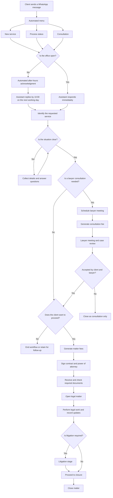
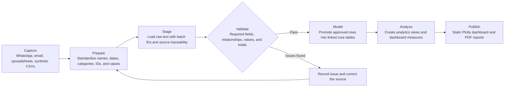
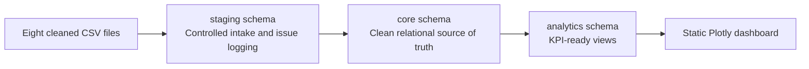

# Client Consultation and Data Workflow

**Author:** Nubia Aparecida Silva Almeida
**Project:** Operacao LegalTech
**Purpose:** Educational data analytics and process documentation

## Fictional Company Profile

Operacao LegalTech represents a fictional, growing law firm that provides
advisory and litigation services. Clients usually make first contact through
WhatsApp. Assistants coordinate triage, lawyers conduct consultations and legal
work, and finance staff manage invoices and payments.

The project uses synthetic educational records. It does not contain real client
or legal matter information.

## Client Consultation Workflow

The client journey begins with an inquiry and continues through triage,
consultation, matter onboarding, legal work, and closure. A request may also end
as a consultation-only service or remain pending for follow-up.

## Data Workflow

The office works Monday-Friday, 09:00-18:00. A weekday contact before 09:00 is
due a human reply by 10:00 that day; contacts after closing and on weekends are
due by 10:00 on the next working day. The default configurable time zone is
Europe/Lisbon; holidays are not excluded. Automatic acknowledgments do not count
as human replies. During office hours, service remains prompt without an added
numerical target. See [communication automation](COMMUNICATION_AUTOMATION.md)
for implemented channel adapters, private records and activation requirements.

Each operational step creates data. The project moves those records through six
controlled stages before presenting them in the dashboard.

## Database Layers

| Layer | Role in the workflow |
|---|---|
| Cleaned files | Supply standardized records for clients, inquiries, consultations, matters, documents, invoices, payments, and users. |
| `staging` | Preserves imported values, batch identity, file provenance, and validation issues. |
| `core` | Stores approved, normalized, and relationally connected records. |
| `analytics` | Presents reporting views and consistent KPI calculations. |
| Static dashboard | Publishes portfolio, service-demand, document, billing, payment, and consultation indicators. |

## Governance Across the Workflow

- **Ownership:** operational, technical, and reporting responsibilities are identified.
- **Quality gates:** critical validation failures prevent promotion into `core`.
- **Privacy:** only synthetic public data is used; credentials remain outside published files.
- **Traceability:** batch IDs, file hashes, validation results, and versioned migrations preserve history.
- **Controlled publication:** reports and dashboard files are generated from approved analytics views.

## Related Documents

- [Project README](../README.md)
- [Communication automation and corrected schedule](COMMUNICATION_AUTOMATION.md)
- [Beginner step-by-step guide](BEGINNER_STEP_BY_STEP_GUIDE.md)
- [Data cleaning project report](DATA_CLEANING_PROJECT_REPORT%20copy.md)
- [Data governance guide](data_governance%20copy.md)
