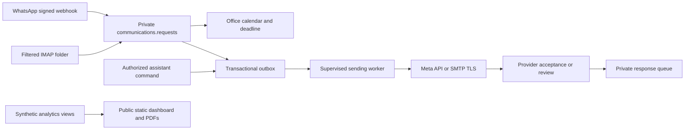

# Private communication automation

Author: **Nubia Aparecida Silva Almeida**
Special thanks to **Adwiteey Mauriya** for his support during the project.

## Corrected response policy

The office opens **Monday-Friday, 09:00-18:00**. For messages received outside
those hours, the assistant's response is due **by 10:00 on the next working day**.
Before 09:00 on a weekday, that means 10:00 the same day. Exactly 18:00 is closed;
Friday evening and weekend messages are due Monday at 10:00. Earlier replies are
allowed. Public holidays are not excluded because no holiday policy was supplied.

`OFFICE_TIMEZONE=Europe/Lisbon` is the configurable default assumption. Receipt and
response timestamps carry offsets; calculations use local office time and handle
summer/winter clock changes. Each event retains its policy version and deadline.
During office hours the specification remains prompt service, with no invented
numerical target. These events have `response_due_at=NULL` and
`no_numeric_target`, rather than being misclassified as after-hours failures.

**Português europeu:** o escritório funciona de segunda a sexta-feira, das 09:00
às 18:00. Os contactos recebidos fora do horário devem obter resposta de um
assistente até às 10:00 do dia útil seguinte. Uma confirmação automática não
substitui a resposta humana. Antes das 09:00 num dia de semana, o prazo é às
10:00 desse mesmo dia.

## What is implemented

- Meta webhook verification, original-body HMAC signature validation, configured
  phone filtering, transactional intake and deduplication by provider message ID.
- A dedicated IMAP folder collector over verified TLS using UIDVALIDITY/UID,
  header-only retrieval and server INTERNALDATE (not the sender's Date header).
- Portuguese acknowledgments with the actual next response deadline.
- A durable PostgreSQL outbox, row locking and review of ambiguous send failures.
- Meta text sending within the supported window, a staff-selected approved
  parameter-free re-engagement template, and authenticated SMTP over TLS.
- Staff reply commands and a private response queue. Provider acceptance of a
  human-authored reply populates the human-response timestamp. Automated
  acknowledgments and re-engagement templates never populate it.
- A new `communications` schema, role, migration and synthetic behavioral tests.

This is implementation code and a deployment procedure, **not an activated
messaging service**. The public dashboard remains a synthetic snapshot. No actual
client messages are sent by tests or PDF generation. GitHub Pages cannot run the
private Python service, scheduled collectors or PostgreSQL.

## Structure and ownership



The assistant monitors the queue at opening and throughout the working day. A
technical operator manages the service, credentials and error monitoring. An
active `core.users` identity is required to queue a staff reply; production login
accounts and command access must restrict who can act for each user. The command
is a trusted operator interface, not an authenticated multi-user web portal.
`legaltech_communications` is a non-login database group role; grant it only to a
private service login. Do not use the public analytics role for channel data.

## Configure a private service

1. Run `uv sync`, configure PostgreSQL using `.env.example`, and apply
   `uv run python -m alembic upgrade head`. This is additive; a database reset is
   not needed. Back up operational data before a production migration.
2. Set `OFFICE_TIMEZONE` and create a least-privileged private service account.
3. For WhatsApp, configure a business account/number, supported API version,
   access token, app secret and verification token in local secrets. Run
   `uv run python -m src.communications serve` behind an HTTPS reverse proxy.
   Route `/webhooks/whatsapp` to port 8787 on loopback, preserve the original body,
   enforce request/rate limits and subscribe the Meta app to message events.
4. For email, use a dedicated server-filtered `LegalTech` folder. Configure IMAP
   and SMTP TLS hosts, the mailbox login (an app password if the provider supports
   it), and the sender address. Providers requiring OAuth-only authentication
   need an OAuth adapter before activation. SMTP implicit TLS uses port 465;
   STARTTLS-only SMTP is not implemented. Set spam/authentication rules at the
   mailbox provider before enabling `EMAIL_AUTO_ACK=true`.
5. Inspect the queue, use approved test recipients, and only then set
   `COMMUNICATIONS_LIVE_SEND=true` in the private environment. Supervise the
   webhook continuously; schedule polling and the one-item worker frequently
   enough to drain expected demand. Example: poll every minute, invoke the worker
   repeatedly while pending work exists, and inspect failed jobs/queue age.
   These schedules must be installed on the private host; GitHub Actions does not
   run the live service.

```sh
uv run python -m src.communications poll-email
uv run python -m src.communications queue
uv run python -m src.communications work-once
```

To queue a human reply, keep the message body in a private file outside version
control, then run:

```sh
uv run python -m src.communications reply \
  --request-id REQUEST_UUID --actor-user-id STAFF_ID \
  --body-file /private/path/reply.txt
```

The worker sends queued items only when live sending is explicitly enabled.
Provider acceptance is **not delivery or reading**. Delivery receipts, message
thread grouping and responses sent outside this service are not automatically
reconciled. Each incoming provider message is a separate tracked request; the
intake count is not a count of unique clients or legal matters.

## Weekend WhatsApp contacts

A Friday contact can have a Monday 10:00 office deadline after the free-text
customer-service window expires. The worker holds that free-text message in
`review`. Configure an approved template with **no parameters** using
`WHATSAPP_REENGAGEMENT_TEMPLATE` and `WHATSAPP_TEMPLATE_LANGUAGE`, then staff can
explicitly queue it:

```sh
uv run python -m src.communications reengage \
  --request-id REQUEST_UUID --actor-user-id STAFF_ID
```

The template does not count as a human answer or guarantee reopening of the
window. Wait for a new customer message before free-text sending, or use another
permitted contact route. The current conservative window check uses the tracked
request's receipt time; staff should reply against the new request after a new
customer message. Provider approval and appropriate permission to contact the
recipient are prerequisites. No template is submitted for approval by this code.

## Failures, attachments and privacy

Database uniqueness prevents duplicate intake and duplicate acknowledgments.
Workers use `FOR UPDATE SKIP LOCKED` to avoid simultaneous claims. A send failure
or a claim older than ten minutes goes to review, not blind retry: a timeout can
happen after provider acceptance. Inspect the provider log before requeuing via
an authorized operator. The current CLI intentionally has no automatic retry of
ambiguous transmissions. Monitor both `review` and stale `sending` states.

Email bodies and attachments stay in the protected mailbox. Header-only email
intake leaves attachment count unknown, not zero. WhatsApp stores a count for
media events but does not download or verify media. No email automatically sets
`core.documents.received_at` or `documents_complete`; staff must review the
expected checklist, identity, malware screening and matter association. Original
message contents remain in the channel system, not in the public repository.

Private sender addresses and queued reply text require an agreed retention and
access policy. No `communications` query is included in the public dashboard
builder. Never put production exports, tokens, email bodies or attachments into
`data/`, `site/`, screenshots, PDFs or Git. The source PDF is referenced, not
republished as a client attachment.

## Tests

```sh
uv run python -m unittest discover -s tests -v
```

Database tests run only against a disposable database with
`ISOLATED_TEST_DATABASE=true`; run migrations first, then:

```sh
uv run python -m tests.integration_communications
```

GitHub Actions provisions its own PostgreSQL service, tests migrations and their
rollback, checks the outbox, then loads and validates the synthetic CSVs. See
[release evidence](RELEASE_VALIDATION.md) for actual results.

## Technical sources

- [Meta Cloud API collection](https://www.postman.com/meta/whatsapp-business-platform/documentation/wlk6lh4/whatsapp-cloud-api)
- [WhatsApp webhook verification](https://whatsapp.github.io/WhatsApp-Nodejs-SDK/api-reference/webhooks/start/)
- [Python IMAP documentation](https://docs.python.org/3/library/imaplib.html)
- [Python SMTP documentation](https://docs.python.org/3/library/smtplib.html)
