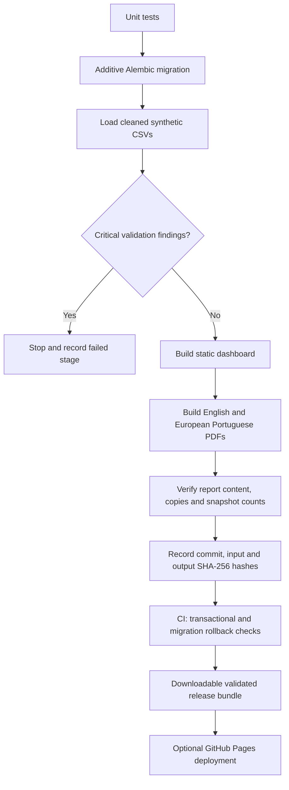

# Reproducible project pipeline

Run from the repository root after configuring a development PostgreSQL database:

```sh
uv sync --frozen
uv run python -m src.pipeline --plan
uv run python -m src.pipeline
```

`--plan` only displays the steps. Running without it applies additive migrations
and loads the committed cleaned synthetic CSVs into the configured database. It
does not reset schemas, start messaging workers, or send messages. The earlier
local migration refusal remains respected: this update tests the full pipeline
in GitHub's disposable database, not by executing it against the local database.

## Stages



Any failing command prevents later stages. `output/pipeline/manifest.json` records
status, stage exit codes, timestamps, commit, report page counts and file hashes.
A failed run does not publish a bundle; previously built local files may remain
on disk, so always check the manifest. The pipeline is for reviewed synthetic
inputs; it does not automatically change raw source records or rerun cleaning
and reconciliation decisions. Update and review cleaned CSVs separately.

Run only one local pipeline at a time against a given database and output folder.
The initial loader is not an upsert service: unchanged source files are skipped,
but changes to already loaded primary keys can require a reviewed update/migration.
Do not resolve such failures by resetting a database containing operational data.

## GitHub execution and downloads

`.github/workflows/tests.yml` is the single build-and-release workflow, named
**Validate project**. It runs on main-branch pushes, pull requests and manual
workflow dispatch. It creates a temporary PostgreSQL 18 service, installs locked
UV dependencies and report fonts, and runs the pipeline. It then executes the
communication database checks, reverses/reapplies migration 0004 and repeats them.
No production secrets or messaging accounts are required.

After success, open the workflow run in GitHub Actions and download
**legaltech-release**. The ZIP contains:

- `site/`: the dashboard, snapshot and both PDF editions;
- `output/validation/database_validation.json`: data-quality results;
- `output/pipeline/manifest.json`: build status and SHA-256 checksums.

Artifacts are retained for 30 days. Generated files are not automatically committed
back to main. The PDFs already committed to the repository remain available;
for a particular pipeline run, use its release bundle. GitHub documents artifact
access in [Downloading workflow artifacts](https://docs.github.com/en/actions/how-tos/manage-workflow-runs/download-workflow-artifacts).

## Optional website publication

The deployment job depends on the successful build in the same workflow and
uses its artifact, rather than an unrelated checkout. It is skipped by default.
To activate it, enable Pages with GitHub Actions as the source and set the
repository Actions variable `ENABLE_GITHUB_PAGES=true`. Then manually run
**Validate project** on main or push the next reviewed change. Pull requests never
deploy. The old independent Pages workflow was removed so it cannot publish
unvalidated files or fail merely because Pages is not enabled.

## Private messaging pipeline

Live message processing remains separate from this synthetic release pipeline:

```text
Signed WhatsApp webhook / scheduled IMAP collection
  -> private requests and response deadlines
  -> persistent outbox
  -> supervised worker
  -> provider acceptance or operator review
```

See [COMMUNICATION_AUTOMATION.md](COMMUNICATION_AUTOMATION.md) for private hosting,
credentials, scheduling and staff responsibilities. The release workflow never
runs these live collectors or senders. Office hours remain Monday-Friday,
09:00-18:00, with after-hours human responses due by 10:00 on the next working day.
